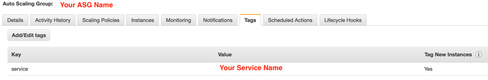

# Backup EC2

---

## Prerequisites

1. Python 3
2. pip3

```shell
    $ sudo apt install python3-pip
```

3. boto3

```shell
    $ pip3 install boto3
```

---

## Getting Started

1. Add a Tag in Auto Scaling Group at AWS console
   

2. Modify .env

```shell
    $ cp env.example .env
```

3. fill in .env

4. Run program

```shell
    $ python3 index.py
```
